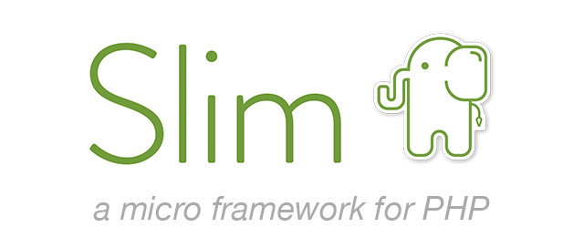

# Slim 4 Framework skeleton



[](https://github.com/MrHDOLEK/slim4-boirlerplate/actions/workflows/php.yml)
[](https://codecov.io/gh/MrHDOLEK/slim4-boirlerplate)
[](https://github.com/MrHDOLEK/slim4-boirlerplate/blob/master/LICENSE)
[](https://phpstan.org/)
[](https://php.net/)


---
#### An Slim 4 Framework skeleton using AMQP and DDD

I was inspired to create this skeleton from: [robiningelbrecht](https://github.com/robiningelbrecht).

## Project setup

### Development
If you have problems with permissions please add sudo before make example:
- `sudo make install`
- `sudo make start`
### Run env for Mac/Linux

- `make install`
- `make start`
- `make db-create`

### Run env for Windows
Please install packages makefile for [Windows](http://gnuwin32.sourceforge.net/packages/make.htm)
- `make install`
- `make start`
- `make db-create`

### Address where the environment is available
- `http://localhost`
## Documentation for a Rest Api
- `http://localhost/docs/v1`
## RabbitMq dashboard
- `http://localhost:15672`
## All commands

-  `make help`

## Dev tooling

Static analysis and code style live in their own isolated composer projects under `tools/`, so their
dependencies never enter the application's dependency graph:

| Tool | Location | Command |
| --- | --- | --- |
| PHPStan (+ custom architecture rules) | `tools/phpstan` | `make phpstan` |
| PHP CS Fixer (blumilksoftware/codestyle) | `tools/cs-fixer` | `make cs-check` / `make cs-fix` |
| Deptrac (layer guard) | `tools/deptrac` | `make deptrac` |

`make install` installs them. To (re)install or bump them on their own:

- `make tools-install`
- `make tools-update`

The layer guard enforces `Infrastructure -> Application -> Domain`. Pre-existing violations are
grandfathered in `deptrac.baseline.yaml`, so only new ones fail the build.

## Deployment

The product is packaged as a Helm chart in `.k8s` — an `app` Deployment (nginx + php-fpm), one
Deployment per declared messaging consumer, a `scheduler` CronJob, and pre-sync Jobs. Every runtime
value comes from a Kubernetes Secret; the image ships no `.env`.

- `make helm-lint`
- `make helm-template`
- `make helm-template-kafka`

### Consumers

Consumers are values-driven: every entry under `consumers` becomes its own Deployment running
`php bin/console.php app:messaging:consume <source>`, so a chart install can run AMQP only, Kafka
only, or both at once.

```yaml
consumers:
  user-events:
    enabled: true
    broker: kafka
    source: user-events
    replicaCount: 2
    resources:
      requests:
        cpu: 50m
        memory: 128Mi
    autoscaling:
      enabled: true
      minReplicas: 1
      maxReplicas: 4
      targetCPUUtilizationPercentage: 75
```

`broker` and `source` are required; `source` is the transport name registered by `AsAmqpQueue` or
`AsKafkaTopic`, and the broker only shows up as the `messaging.slim4-app/broker` label. Every
consumer gets its own optional HPA.

`.k8s/values-amqp.yaml` and `.k8s/values-kafka.yaml` are ready-made overlays that pick one broker,
enable its consumer and set its env keys.

### Jobs

| Job | Values key | Hook | Command |
| --- | --- | --- | --- |
| Doctrine migrations | `jobs.migrate` | PreSync | `vendor/bin/doctrine-migrations migrate` |
| Avro schema registration | `jobs.kafkaSchemaRegister` | PreSync | `app:kafka:schema:register` |
| Fixtures | `jobs.seed` | PostSync | `db:seed` |

`jobs.kafkaSchemaRegister` is off by default and pushes every `resources/avro/*.avsc` to the schema
registry before the new pods roll, so Kafka producers never write against an unregistered subject.

### Secret keys

All of these go into `env.secret` (or the Secret named by `env.existingSecret`).

| Scope | Keys |
| --- | --- |
| App | `APP_NAME`, `ENVIRONMENT`, `DISPLAY_ERROR_DETAILS`, `LOG_ERRORS`, `LOG_ERROR_DETAILS` |
| Database | `DB_HOST`, `DB_PORT`, `DB_NAME`, `DB_USER`, `DB_PASSWORD`, `DOCTRINE_CACHE_TTL`, `SLOW_QUERY_THRESHOLD` |
| Redis | `REDIS_HOST`, `REDIS_PORT`, `REDIS_PASSWORD`, `REDIS_CACHE_DB`, `REDIS_DEFAULT_DB` |
| Messaging | `EVENT_BROKER` (`amqp` or `kafka`, picks the broker domain events are published to) |
| AMQP | `RABBITMQ_HOST`, `RABBITMQ_PORT`, `RABBITMQ_USER`, `RABBITMQ_PASS`, `RABBITMQ_VHOST` |
| Kafka | `KAFKA_BROKERS`, `KAFKA_CONSUMER_GROUP`, `KAFKA_SCHEMA_REGISTRY_URL`, `KAFKA_AUTO_OFFSET_RESET` |

## Some examples

### Registering a new route

```php
namespace App\Application\Actions\User;

class GetAllUsersAction extends UserAction
{
    public function __construct(
        private readonly UserService $userService,
        protected LoggerInterface $logger,
    ) {
        parent::__construct($logger);
    }

    protected function action(): Response
    {
        $user = $this->userService->getAllUsers();

        return $this->respondWithJson(new UsersResponseDto($user));
    }
}
```

Head over to `config/routes.php` and add a route for your RequestHandler:

```php
return function (App $app) {
        $group->get("/users", GetAllUsersAction::class)
            ->setName("getAllUsers");
};
```

### Console commands

The console application uses the Symfony console component to leverage CLI functionality.


```php
#[AsCommand(name: 'app:user:create')]
class CreateUserConsoleCommand extends Command
{
    protected function execute(InputInterface $input, OutputInterface $output): int
    {
        // ...
        return Command::SUCCESS;
    }
}
```

### Scheduling Commands

To schedule a command, we use the GO\Scheduler class. This class allows us to define the timing and frequency of command execution. Here's an example of how to schedule a command to run daily:

```php
$scheduler = new GO\Scheduler();
$scheduler->php('/path/to/command app:user:create')->daily();
$scheduler->run();
```
In this example, the app:user:create command is scheduled to run every day.

#### Running the Scheduler
The scheduler should be triggered by a system cron job to ensure it runs at regular intervals. Typically, you would set up a cron job to execute a PHP script that initializes and runs the scheduler.

For instance, a cron job running every minute might look like this:

```bash
* * * * * ./bin/console.php schedule
```

This setup ensures that your scheduled commands are executed reliably and on time.


### Domain event and event handlers

The framework implements the amqp protocol with handlers that allow events to be easily pushed onto the queue.
Each event must have a handler implemented that consumes the event.

#### Creating a new event

```php
class UserWasCreated extends DomainEvent
{
 
}
```

#### Creating the corresponding event handler

```php
namespace App\Domain\Entity\User\DomainEvents;

#[AsEventHandler]
class UserWasCreatedEventHandler implements EventHandler
{
    public function __construct(
    ) {
    }

    public function handle(DomainEvent $event): void
    {
        assert($event instanceof UserWasCreated);

        // Do stuff.
    }
}
```

### Eventing

#### Create a new event

```php
class UserWasCreated extends DomainEvent
{
    public function __construct(
        private UserId $userId,
    ) {
    }

    public function getUserId(): UserId
    {
        return $this->userId;
    }
}
```

### Async processing of events

Both brokers are wired behind the same `App\Infrastructure\Messaging\Transport` contract, so a domain event can be
routed to either one. `UserEventQueue` (RabbitMQ) and `UserEventTopic` (Kafka) are the two interchangeable bindings of
the same domain concept, and both hand their messages to the same `EventQueueWorker`.

#### Registering a transport for your events

```php
#[AsAmqpQueue(name: "user-command-queue", numberOfWorkers: 1)]
class UserEventQueue extends AmqpQueue
{
    public function __construct(
        AMQPChannelFactory $AMQPChannelFactory,
        MessageSerializer $serializer,
        FailedQueueFactory $failedQueueFactory,
        private readonly EventQueueWorker $worker,
    ) {
        parent::__construct($AMQPChannelFactory, $serializer, $failedQueueFactory);
    }

    public function getWorker(): Worker
    {
        return $this->worker;
    }
}
```

#### Publishing events

The domain never names a broker, it is handed an `EventPublisher` that wraps whichever transport is configured.

```php
final readonly class UserEventsService
{
    public function __construct(
        private EventPublisher $eventPublisher,
    ) {}

    public function userWasCreated(User $user): void
    {
        $this->eventPublisher->publish(new UserWasCreated($user));
    }
}
```

#### Choosing the broker

`EVENT_BROKER` decides which transport the `EventPublisher` is built on, `amqp` (default) or `kafka`. The map lives in
`config/container.php`.

#### Removing a broker

Each broker is a self-contained unit. Everything a broker owns lives under its own directory, and the only shared
files that name it are the two wiring files plus the settings and chart values.

To drop RabbitMQ, delete:

```
src/Infrastructure/AMQP/
tests/Infrastructure/AMQP/
```

To drop Kafka, delete:

```
src/Infrastructure/Kafka/
src/Application/Console/Utility/KafkaSchemaRegisterConsoleCommand.php
tests/Infrastructure/Kafka/
resources/avro/
```

`KafkaSchemaRegisterConsoleCommand` cannot live under `src/Infrastructure/Kafka/` because
`ConsoleCommandCompilerPass` only scans `src/Application/Console`.

Then drop the broker's entry from `config/compiler-passes.php` (the transport attribute), `config/container.php`
(the service definitions, the `EventPublisher` map and the `BrokerHealthCheck` map), `config/settings.php`, the
matching `.env` keys and `.k8s/values-*.yaml`. Nothing under `src/Domain`, `src/Infrastructure/Events`,
`src/Infrastructure/Messaging` or the other broker's tests refers to it.

#### Consuming your transport

```bash
> docker-compose run --rm php bin/console.php app:messaging:consume user-command-queue
> docker-compose run --rm php bin/console.php app:messaging:consume user-events
```

### Create new entity

If you have created a new entity and want to map it to a database you must create a xml in src/Infrastructure/Persistence/Doctrine/Mapping . 
It must be named so as to indicate where exactly the entity to be mapped is located.

### Binding of interfaces/Registry global objects

To register a dependency or create a single configured global instance, you need to go to config/container.php

### Mapping database data to custom objects

To map data from a database to a custom object you need to extend something from Doctrine/DBAL/Types .

```php
use App\Domain\ValueObject\UserType;
use Doctrine\DBAL\Platforms\AbstractPlatform;
use Doctrine\DBAL\Types\StringType;

class UserTypeType extends StringType
{
    const TYPE_NAME = 'UserType';

    public function convertToPHPValue($value, AbstractPlatform $platform): ?UserType
    {
        return null !== $value ? UserType::fromString($value) : null;
    }

    public function getName()
    {
        return self::TYPE_NAME;
    }
}
```

After extending, you need to add a note in the xml that you are mapping a field to an object.

```xml
    <field name="type" type="UserType" column="type" nullable="true"/>
```

Finally, you must add the new type in config/container.php where doctrine is configured

```php
use Doctrine\DBAL\Connection;
use Doctrine\DBAL\DriverManager;
use Doctrine\DBAL\Types\Type;
use Doctrine\ORM\EntityManager;
use Doctrine\ORM\EntityManagerInterface;
use Doctrine\ORM\Tools\Setup;

return [
...
    EntityManager::class => function (Settings $settings): EntityManager {
        $config = Setup::createXMLMetadataConfiguration(
            $settings->get("doctrine.metadata_dirs"),
            $settings->get("doctrine.dev_mode"),
        );
        if (!Type::hasType('UserType')) {
          Type::addType('UserType', UserTypeType::class);
        }
        return EntityManager::create($settings->get("doctrine.connection"), $config);
    },
 ...
];

```


### Database migrations

To manage database migrations, the doctrine/migrations package is used.

```xml
<doctrine-mapping
xmlns="http://doctrine-project.org/schemas/orm/doctrine-mapping"
xmlns:xsi="http://www.w3.org/2001/XMLSchema-instance"
xsi:schemaLocation="http://doctrine-project.org/schemas/orm/doctrine-mapping
https://www.doctrine-project.org/schemas/orm/doctrine-mapping.xsd">
<entity name="App\Domain\Entity\User\User" table="users">
<id name="id" type="integer" column="id">
<generator strategy="SEQUENCE"/>
<sequence-generator sequence-name="user_id_seq" allocation-size="1" initial-value="1"/>
</id>
<field name="username" type="string" column="name" length="64" nullable="true"/>
<field name="firstName" type="string" column="surname" length="64" nullable="true"/>
<field name="lastName" type="string" column="email" length="64" nullable="true"/>
<options>
<option name="collate">utf8mb4_polish_ci</option>
</options>
</entity>
</doctrine-mapping>
```

The mapping is done using a yaml which maps your entities from the domain to a structure in the database . 
If you change something in yaml, you can use the commands below to generate a migration based on the difference.

```bash
> docker-compose run --rm php vendor/bin/doctrine-migrations diff
> docker-compose run --rm php vendor/bin/doctrine-migrations migrate
```

## Documentations

Learn more at these links:

- [Slim framework](https://www.slimframework.com)
- [PHP-DI](https://php-di.org/)
- [Symfony Console Commands](https://symfony.com/doc/current/console.html)
- [Doctrine migrations](https://www.doctrine-project.org/projects/doctrine-migrations/en/3.6/)
- [Doctrine reference](https://www.doctrine-project.org/projects/doctrine-bundle/en/latest/configuration.html)
- [Twig](https://twig.symfony.com/)
- [Symfony Serializer](https://symfony.com/doc/current/serializer.html)